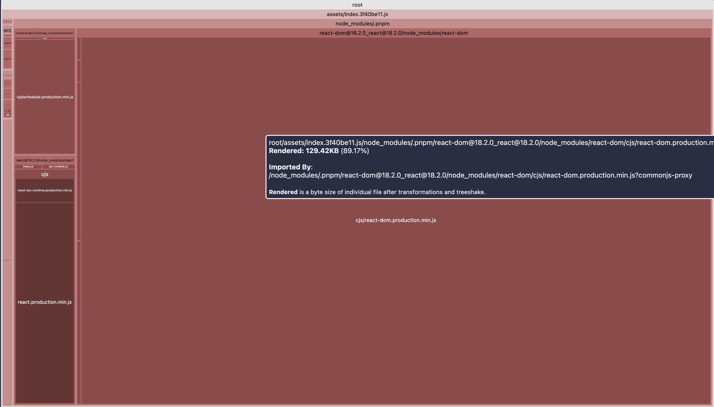
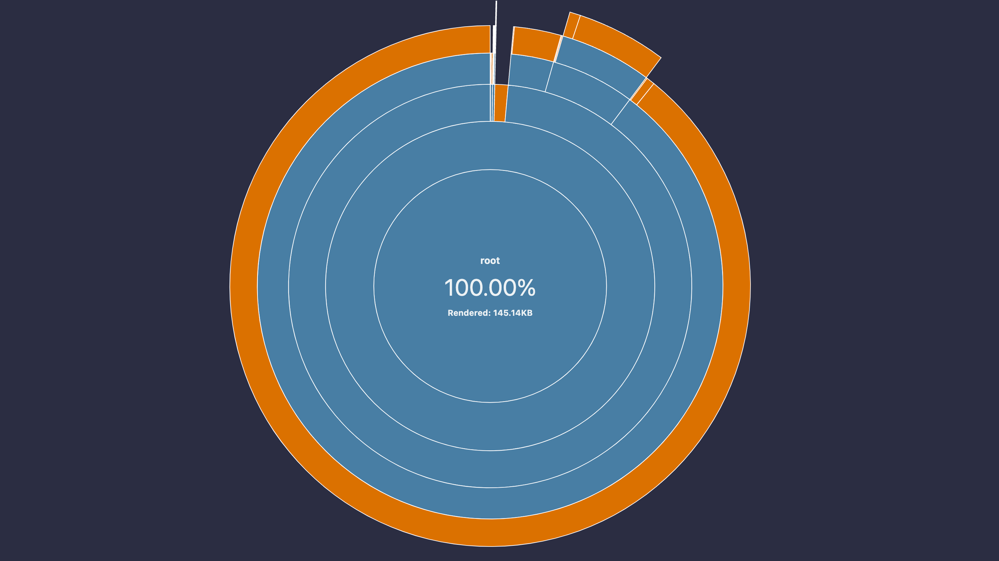
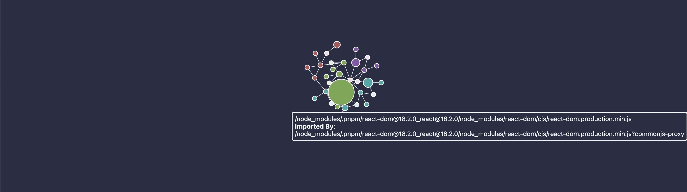

# vite-bundle-visualizer

Visualize vite bundle, like [webpack-bundle-analyzer](https://github.com/webpack-contrib/webpack-bundle-analyzer).

Use [rollup-plugin-visualizer](https://github.com/btd/rollup-plugin-visualizer).

## Usage

```console
# In your vite project's root
$ npx vite-bundle-visualizer
# Then open stats.html in browser

# Use specified vite config file
$ npx vite-bundle-visualizer -c your.config.js
```

```console
$ vite-bundle-visualizer --help

vite-bundle-visualizer

Usage:
  $ vite-bundle-visualizer <command> [options]

Options:
  -h, --help                Display this message
  --template -t <template>  Template to use, options are "raw-data" (JSON), "treemap", "list", "sunburst" and "network" (default: treemap)
  --output -o <filepath>    Output file path, should be "**/*.html" or "**/*.json" (default: /var/folders/lb/9tn84c8x42nctvbs1fb3vxd40000gn/T/tmp-20782-nmqZuvXaZNxh/stats.html)
  --open <open>             Should open browser after generated, except when template is "json" (default: true)
  --config -c <file>        Use specified vite config file
  --entry --input -i        Use specified entry file, default is "index.html"
  --sourcemap               use sourcemap to calculate sizes of modules. By idea it will present more accurate results, defaults is false
  --sourcemap               use sourcemap to calculate sizes of modules. By idea it will present more accurate results, defaults is false
  --mode -m <mode>          set env mode, defaults to production
```

## Screenshots

### Visualizer Templates

#### Treemap

```console
$ vite-bundle-visualizer
```



#### Sunburst

```console
$ vite-bundle-visualizer -t sunburst
```



#### Network

```console
$ vite-bundle-visualizer -t network
```



#### Raw data

Output raw data (JSON) of stats

```console
# @deprecated vite-bunlde-visualizer -t json
$ vite-bundle-visualizer -t raw-data
```

[demo/stats.json](./demo/stats.json)

#### List

Output yml file with all the data

```console
$ vite-bundle-visualizer -t list
```

[demo/stats.yml](./demo/stats.yml)

## Dependencies

- [rollup-plugin-visualizer](https://github.com/btd/rollup-plugin-visualizer)

## License

[MIT](LICENSE)
